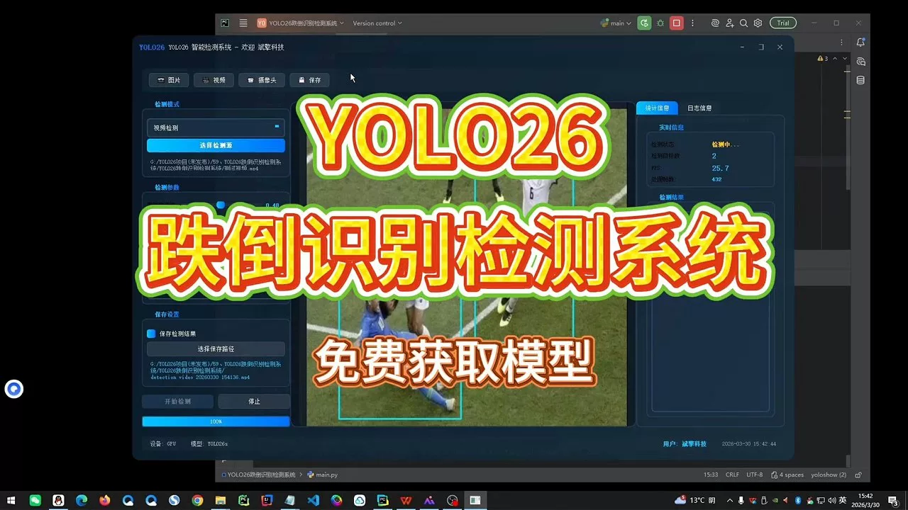
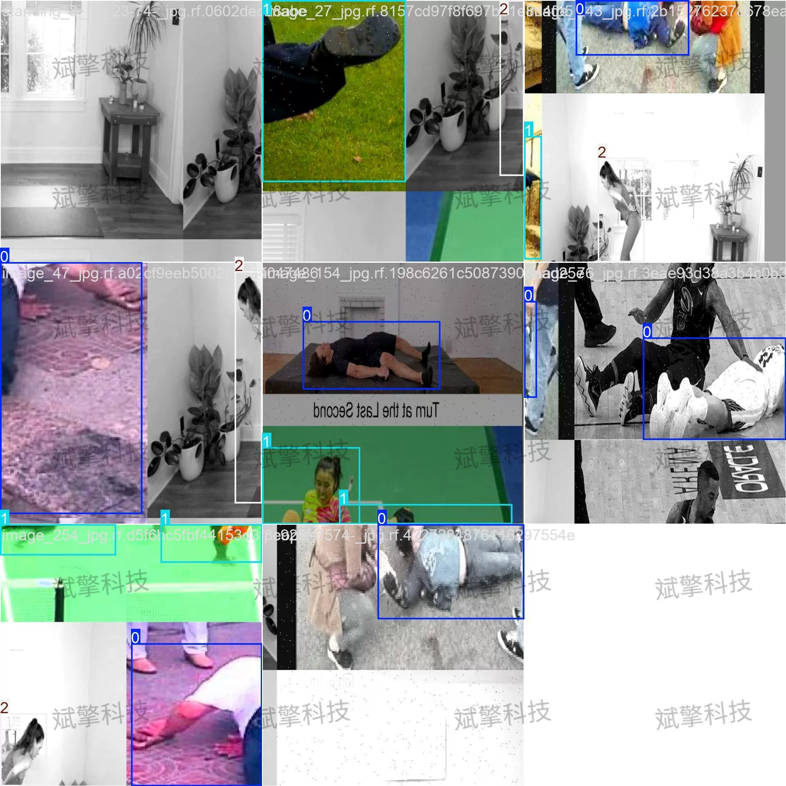
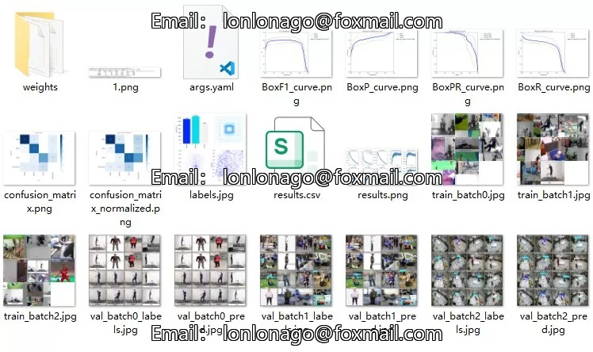
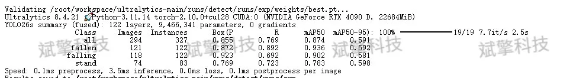
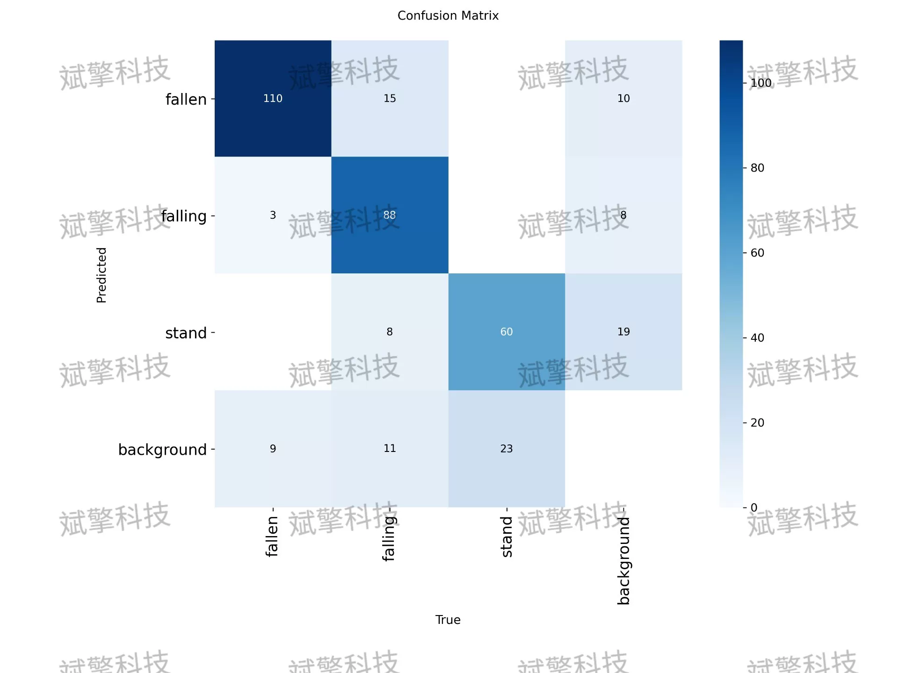
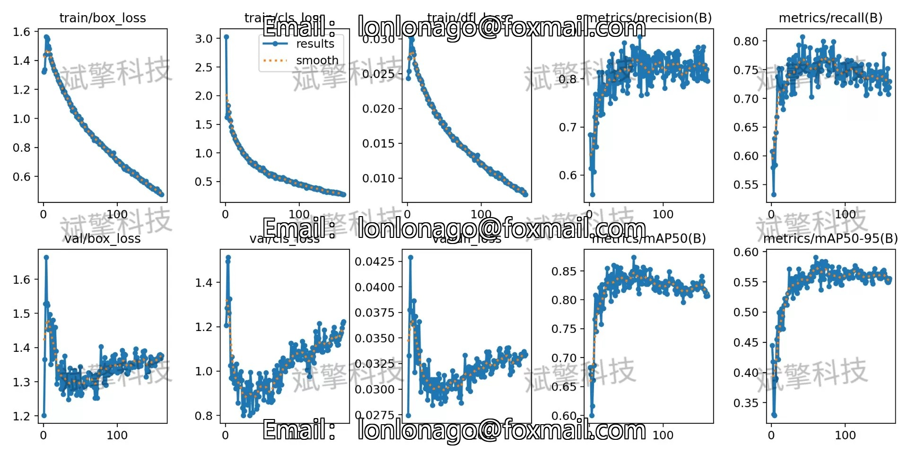
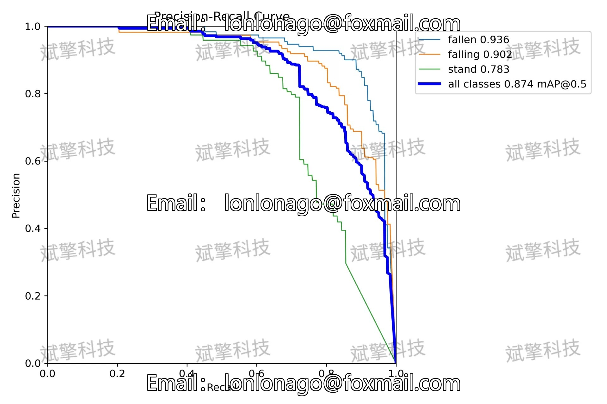
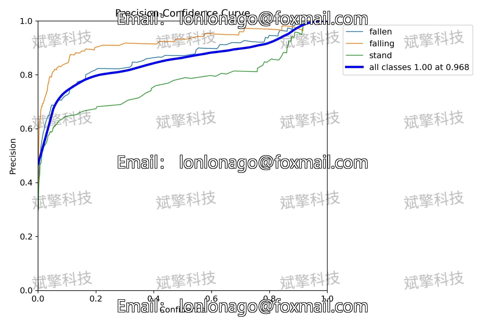
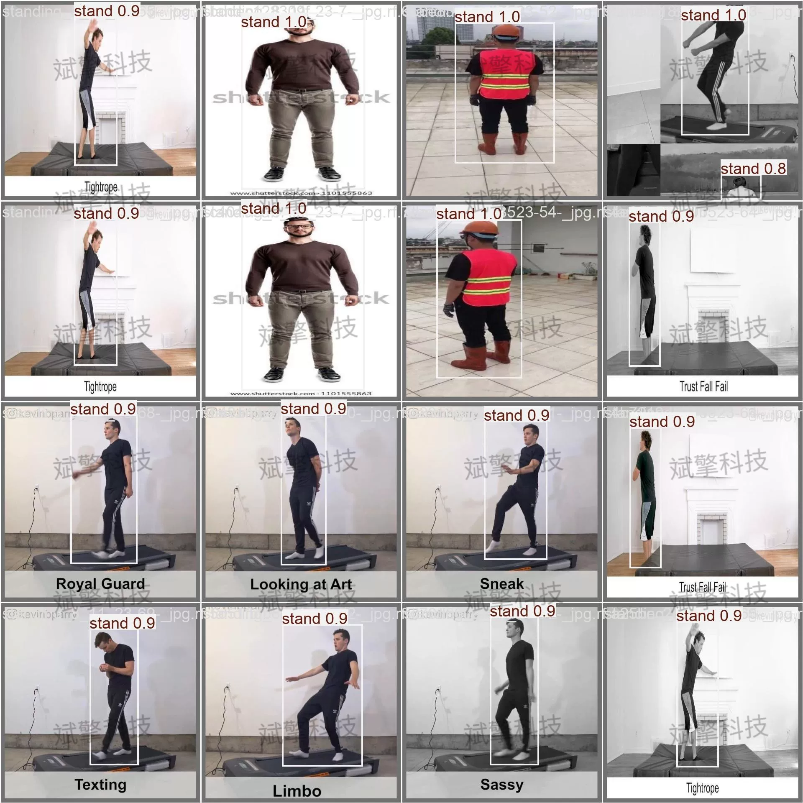

# YOLOv26 Fall Detection System | Model + UI Interface

## Body

The YOLOv26s fall detection system is a key technology in the fields of smart elderly care, medical monitoring, and public safety. This paper constructs a fall detection system based on the YOLOv26s object detection model, which includes three behavior states: fallen (already fell), falling (falling process), and stand (standing). The system uses YOLOv26s as the backbone network and trains and validates on a dataset containing 3888 labeled images. The experimental results show that the overall mAP50 of the model reaches 0.874, with the "already fallen" category performing the best (mAP50=0.936), the "falling process" achieving a precision rate of up to 0.923, and the "standing" category having relatively weaker detection effects (mAP50=0.783). The training process converges stably without overfitting. The system performs excellently in real-time, with a single image inference time of only 3.5ms, demonstrating good deployment feasibility. This study provides an efficient and accurate technical solution for real-time detection of falls.

The dataset used in this study is self-built for fall behavior detection, comprising three human behavior states: fallen (already fell), falling (falling process), and stand (standing).
The dataset consists of 3888 labeled images, divided into a training set and a validation set at a ratio of 9:1:
Training set    3594 images
Validation set    294 images

Free reservation for remote installation. Unsuccessful full refund.
Purchase comes with the following resources (auto-unlocked in Baidu Cloud):
YOLO detection project complete source code
YOLO format dataset
Training code + UI interface code
Trained model + result images
Software install package
Add WeChat to make a reservation for remote installation (automatically displayed WeChat ID after purchase) - Unsuccessful, full refund

## Images

## Payment

Here is a pay link on Stripe ( https://buy.stripe.com/3cs8yP7sY87d0vu9AB ). Please contact me lonlonago@foxmail.com after funding $89, and I will send you a complete data files , thank you!

